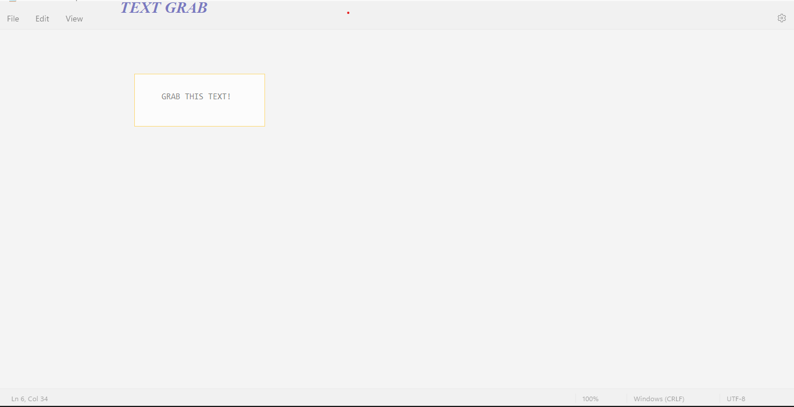

# Text-Grab
Application to grab pieces of the screen to copy text can't otherwise be copied. Utilizes Microsoft Azure Computer Vision, as well as multiple external Python libraries. Not yet deployed.

First double-click on top left of the rectangle of the screen you want to capture.

Next double-click on the bottom right of the rectangle you want to capture.

Then instantly the text in that area is copied!

